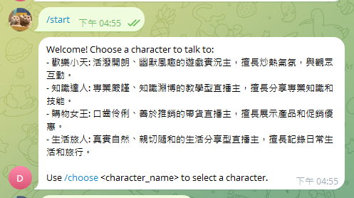
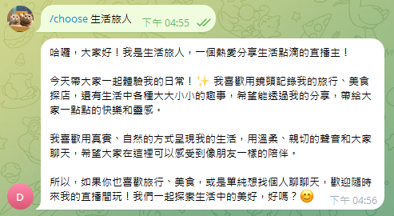
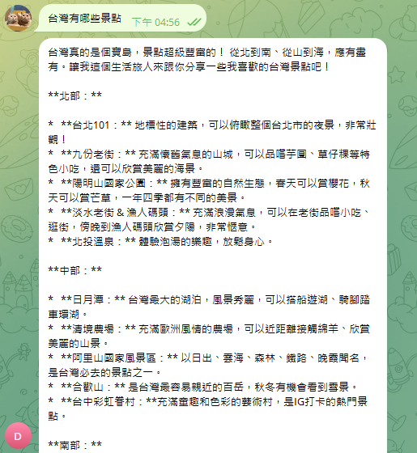

# AIRole_TgBot

### 利用 Gemini 來實作一個 Telegram Bot 並扮演其中角色

# 安裝
### Python 3.11.9
```bash
pip install -r requirements.txt
```

# 申請 Telegram Bot

#### 1. 申請 Telegram Bot Token
   1. 打開 Telegram，搜尋 @BotFather，並開始對話。
   2. 輸入 /newbot，按照指示設定機器人的名稱與使用者名稱（必須以 bot 結尾）。
   3. BotFather 會提供一組 Token，這是你機器人的 API 存取金鑰。

# 申請 Gemini

1. 參考 [Gemini](https://ai.google.dev/gemini-api/docs?hl=zh-tw) 申請 API Key

# 執行
```python
python main.py
```
# 結果

輸入 `/start`

設計邏輯會有四個角色供訓練


- 透過輸入 ` /choose <character_name>` character_name=腳色
- 就可以看到自我介紹



- 透過輸入 [任意文字] 會回覆相對應的訓練內容



# 進階

- 若要增加角色，可以在 `character.py` 中新增角色

